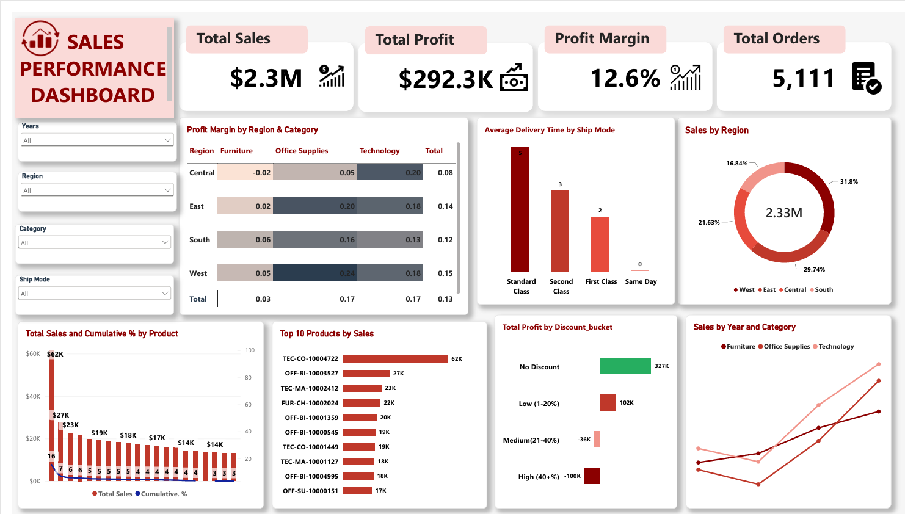

# Superstore Sales Analysis

End-to-end data analysis project using SQL (PostgreSQL) and Power BI 
on the Superstore dataset. Covers 15 business questions from YoY growth 
to RFM segmentation and cohort retention.

## 🛠️ Tools

- **PostgreSQL** — Data storage and analysis
- **Power BI** — Interactive dashboard
- **Dataset** — Superstore sales (2023–2026, ~10K rows)

## 📊 Dashboard Preview

## 🔍 Business Questions Answered

### Intermediate
1. Year-over-Year Sales Growth
2. Running Total of Sales
3. Top 3 Products per Category
4. Above-Average Customers
5. Discount vs Profit
6. Repeat vs One-time Customers
7. Shipping Delay by Mode
8. Region-wise Sales & Profit

### Advanced
9. RFM Segmentation (Champion, Loyal, At Risk, Lost)
10. Pareto Analysis (80/20 Rule)
11. Cohort Retention
12. Profit Margin Pivot (Region × Category)
13. Month-over-Month Growth
14. Consistently Loss-Making Products
15. Customer Lifetime Value (CLV)

## 💡 Key Insights

- **Sales grew 21.4% in 2026** after recovering from a 4.3% dip in 2024 — healthy U-shaped trend.
- **Discounts above 20% destroy profit** — High-discount orders (40%+) lost ~$100K.
- **50% of customers are "Lost"** — only 14% are Champions. Retention opportunity.
- **Central + Furniture is the only loss-making region-category combo** (-0.02% margin).
- **Standard Class shipping** takes ~5 days — slowest among all modes.
- **Pareto principle applies partially** — top products drive the majority of sales.

## 📁 Files

- `superstore_analysis.sql` — All 15 SQL queries
- `Superstore_Dashboard.pbix` — Power BI file
- `dashboard_preview.png` — Dashboard screenshot
- `Superstore_Dashboard.pdf` — PDF export

## 🚀 Skills Demonstrated

- **SQL:** CTEs, window functions (LAG, NTILE, RANK, ROW_NUMBER, SUM OVER), 
  CASE, FILTER, JOINs, date functions
- **Analytics:** RFM segmentation, cohort retention, Pareto, YoY/MoM growth
- **Visualization:** Power BI, DAX measures, conditional formatting, slicers

## 👤 Author

Saklain Alam — [LinkedIn](https://www.linkedin.com/in/saklain-alam-0342ab408)
